# Projet Taskboard
## Etape 1: Gestion des secrets

### Questions - Réponses:

**Qu'est-ce qu'un secret dans le contexte d'une application web ?**
Dans le contexte d’une application web, un secret désigne toute information sensible nécessaire au bon fonctionnement et à la sécurité du système. Cela inclut par exemple les mots de passe, les clés API, les clés JWT ou encore les tokens d’authentification. Ces éléments permettent d’accéder à des services, de sécuriser des échanges ou d’authentifier des utilisateurs. Il est donc essentiel de garantir leur confidentialité afin d’éviter tout accès non autorisé.

**Pourquoi est-il dangereux de commiter des secrets même dans un dépôt privé ?**
Commiter des secrets dans un dépôt Git, même privé, représente un risque important. Tous les collaborateurs ayant accès au dépôt peuvent consulter ces informations. De plus, une erreur de configuration peut rendre le dépôt public, ou un compte développeur peut être compromis, exposant ainsi les données sensibles. Un autre problème majeur est que Git conserve l’historique complet des modifications : même si les secrets sont supprimés par la suite, ils restent accessibles dans les anciens commits.

**Comment détecter si des secrets ont déjà été leakés dans l'historique Git ?**
Pour détecter si des secrets ont été exposés, il est possible d’effectuer des recherches manuelles à l’aide de commandes comme `git log` ou `git grep`. Cependant, il est plus efficace d’utiliser des outils spécialisés tels que GitGuardian, TruffleHog ou Gitleaks, qui analysent automatiquement l’historique Git afin d’identifier des motifs correspondant à des données sensibles.

**Que se passe-t-il si vous supprimez le fichier `.env` mais que le commit initial est conservé dans l'historique ?**
Supprimer simplement le fichier `.env` ne suffit pas à sécuriser les informations si celui-ci a déjà été versionné. Le fichier reste accessible dans les anciens commits et peut être récupéré facilement. Les secrets doivent donc être considérés comme compromis. Il est alors nécessaire de réécrire l’historique Git pour les supprimer définitivement, puis de révoquer ces secrets et en générer de nouveaux afin de garantir à nouveau la sécurité de l’application.

### Mise en place

> Purge du `.env` de tout l'historique
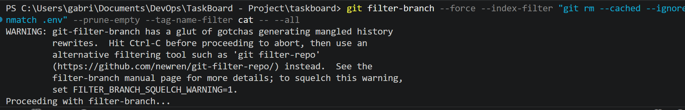

> Nettoyage des références Git
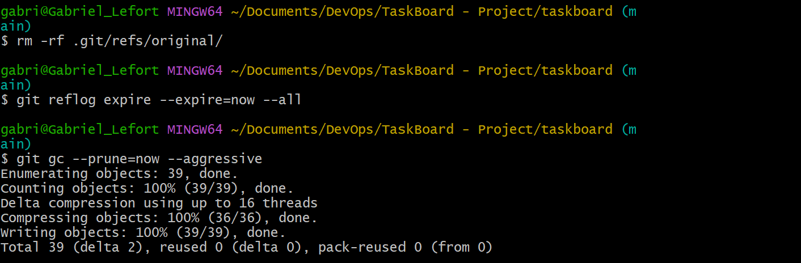

> Push forcé
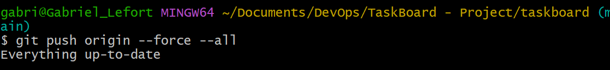

> Vérification des logs: `git log --all --full-history -- .env`
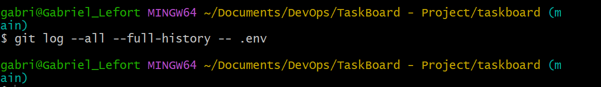

## Etape 2: Conteneurisation

### Questions - Réponses:

**Pourquoi conteneuriser une application Node.js alors qu'on peut la lancer directement ?**

Conteneuriser une application Node.js permet de garantir qu’elle fonctionne de la même manière sur tous les environnements (dev, test, production), sans dépendre de la machine locale. Cela évite les problèmes de version de Node, de dépendances ou de configuration. Un conteneur isole aussi l’application, ce qui améliore la sécurité et facilite le déploiement.

**Qu'est-ce que le concept de « build reproductible » et pourquoi est-il important ?** 

Un build reproductible signifie que l’application peut être reconstruite à l’identique à chaque fois, avec les mêmes dépendances et la même configuration. C’est important car cela garantit que le comportement de l’application reste constant entre les environnements et évite les bugs liés aux différences de versions ou de dépendances.

**Quelle est la différence entre une image de développement et une image de production ?**

Une image de développement est conçue pour faciliter le travail du développeur : elle peut inclure des outils de debug, le hot reload et des dépendances complètes. Une image de production est optimisée pour être légère, sécurisée et performante, avec uniquement le code nécessaire pour exécuter l’application, sans outils inutiles.

### Mise en place

> Mise en place du Docker et exécution:
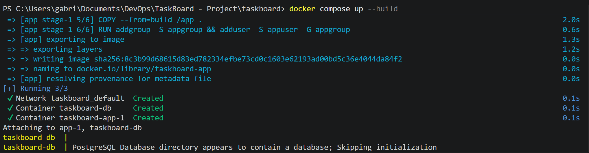

>Vérification de l'image à moins de 300Mo
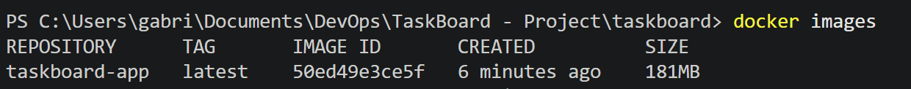

>Vérification du processus pour voir s'il ne tourne pas en root:
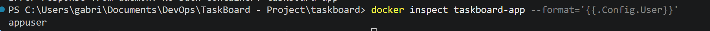

>Le healthcheck répond correctement (la commande en question marchait pas donc j'ai fait `docker ps` pour vérifier)
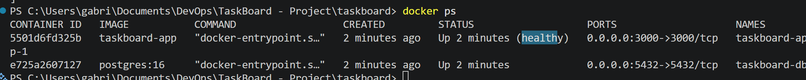

## Etape 3: Tests automatisés

### Questions - Réponses:

**Qu'est-ce que la pyramide des tests ? Quels types de tests existent ?**

La pyramide des tests est un modèle qui organise les tests en trois niveaux selon leur quantité et leur coût. À la base, on trouve les tests unitaires, nombreux et rapides. Au milieu, les tests d’intégration, moins nombreux et un peu plus complexes. Au sommet, les tests end-to-end, peu nombreux mais coûteux et plus lents. L’objectif est d’avoir beaucoup de tests simples et rapides, et peu de tests complexes.

**Quelle différence entre un test unitaire, un test d'intégration et un test end-to-end ?**

Un test unitaire vérifie une petite partie du code isolée, comme une fonction ou un module. Un test d’intégration vérifie que plusieurs composants fonctionnent correctement ensemble, par exemple une API avec sa base de données. Un test end-to-end simule le comportement complet d’un utilisateur, en testant toute l’application de bout en bout, du frontend jusqu’à la base de données.

**Qu'est-ce que la couverture de code ? Est-ce un indicateur suffisant de la qualité des tests ?**

La couverture de code mesure le pourcentage du code exécuté par les tests. Elle permet de savoir quelles parties du code sont testées. Cependant, ce n’est pas un indicateur suffisant de qualité, car un test peut couvrir du code sans vraiment vérifier son bon fonctionnement. Il est donc important d’avoir des tests pertinents, pas seulement une couverture élevée.

**Comment tester une API REST ? Quels outils existent pour ça ?**

Tester une API REST consiste à envoyer des requêtes HTTP (GET, POST, PUT, DELETE) et vérifier les réponses (statut, données, erreurs). Cela peut se faire manuellement avec des outils comme Postman ou Insomnia, ou automatiquement avec des tests en code utilisant des bibliothèques comme Supertest ou Jest.

### Mise en place

> Mise en place du lint pour faire les tests:
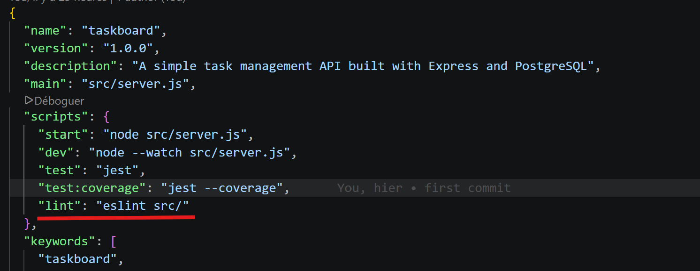

>Vérification du `npm run test` et du résultat
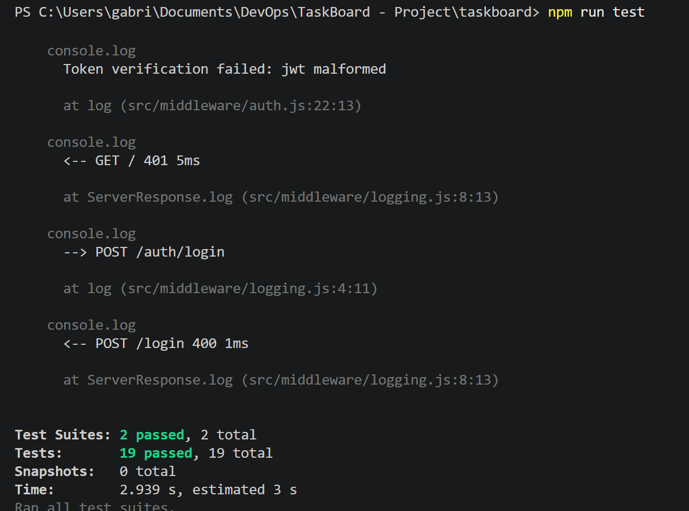
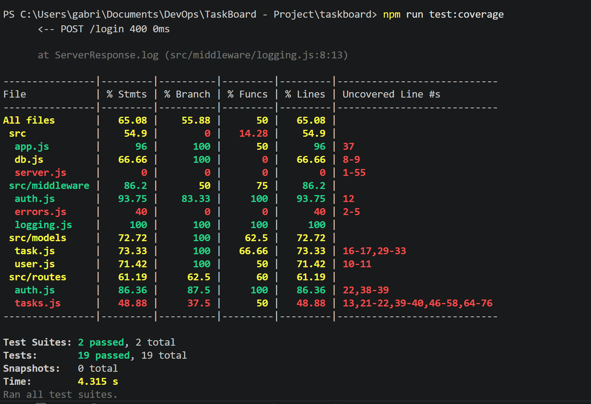

>Verification du npm run lint 
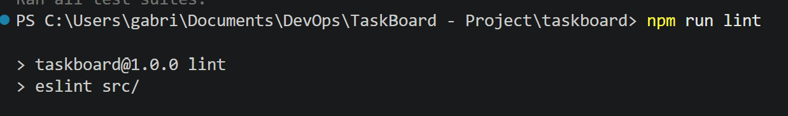

## Etape 4: Pipeline CI : intégration continue

### Questions - Réponses:

**Quelle est la différence entre CI (Intégration Continue) et CD (Déploiement Continu) ?**

La CI (Continuous Integration) consiste à automatiser la validation du code à chaque modification : installation des dépendances, exécution des tests, vérification du lint, build de l’application. L’objectif est de détecter rapidement les erreurs et garantir que le code reste toujours fonctionnel.

La CD (Continuous Deployment / Delivery) va plus loin : elle automatise le déploiement de l’application après validation. En Continuous Delivery, le déploiement est prêt mais déclenché manuellement. En Continuous Deployment, il est entièrement automatique après une CI réussie.

**Qu'est-ce qu'un runner GitHub Actions ? Où s'exécute-t-il ?**

Un runner GitHub Actions est une machine qui exécute les jobs définis dans ton pipeline (tests, build, etc.).

Il peut s’exécuter :
soit sur des serveurs fournis par GitHub (runners hébergés)
soit sur une machine que tu configures toi-même (self-hosted runner)

**Qu'est-ce qu'un artefact de pipeline ? Dans quels cas est-il utile ?**

Un artefact de pipeline est un fichier généré pendant l’exécution du pipeline et sauvegardé pour être réutilisé ou consulté plus tard.

Exemples :
- rapport de couverture de tests
- build de l’application (fichiers compilés)
- image Docker exportée
- logs ou résultats d’analyse

C’est utile pour :

partager des résultats entre jobs
garder une trace (debug)
préparer un déploiement sans rebuild
Comment les jobs peuvent-ils dépendre les uns des autres ?

Dans un pipeline, les jobs peuvent être organisés avec des dépendances.

Par exemple :

- un job test doit réussir avant un job build
- un job build doit réussir avant un job deploy

## Etape 5: Déploiement local via SSH

### Questions - Réponses:

**Comment GitHub Actions peut-il se connecter à une machine locale derrière un NAT ?**

Par défaut, une machine locale n’est pas accessible depuis Internet à cause du NAT et du firewall. GitHub Actions ne peut donc pas initier une connexion directe. La solution consiste à inverser la connexion :
la machine locale ouvre une connexion sortante vers un serveur accessible publiquement (ou directement vers le runner via un tunnel), ce qui permet ensuite à GitHub Actions de “revenir” vers la machine à travers ce tunnel. (reverse SSH tunnel)

**Qu'est-ce qu'un tunnel SSH ? Comment fonctionne le port forwarding inversé (R) ?**

Un tunnel SSH permet de faire passer du trafic réseau de manière sécurisée à travers une connexion SSH. Avec le port forwarding inversé (-R) : `ssh -R 2222:localhost:22 user@serveur`

**Qu'est-ce qu'un déploiement idempotent ? Pourquoi est-ce important ?**

Un déploiement est idempotent lorsqu’il peut être exécuté plusieurs fois sans provoquer d’effets indésirables. par exemple :
- relancer le déploiement ne casse rien
- ne crée pas de doublons
- remet simplement l’état attendu

C’est important car les pipelines CI/CD peuvent être relancés, les déploiements peuvent échouer partiellement et il faut pouvoir “réappliquer” sans tout casser

**Qu'est-ce qu'un healthcheck post-déploiement ? Que doit-il vérifier ?**

Un healthcheck post-déploiement est une vérification automatique après le déploiement pour s’assurer que l’application fonctionne correctement. Il doit vérifier :

- que l’application répond (ex : /health)
- que le serveur est accessible (HTTP 200)
- que les dépendances critiques fonctionnent (ex : connexion DB)
- que l’application n’est pas en erreur (pas de 500)